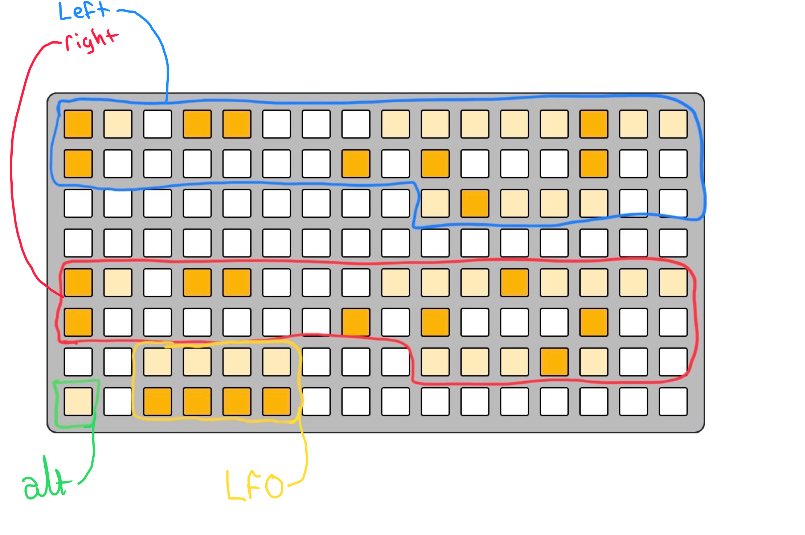
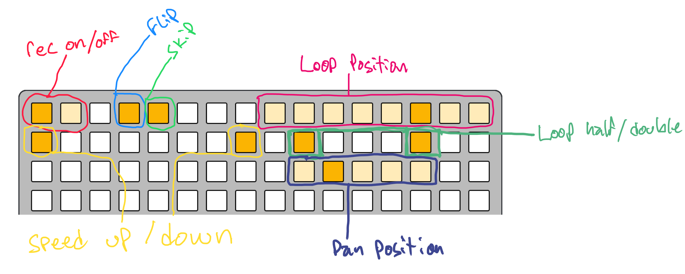
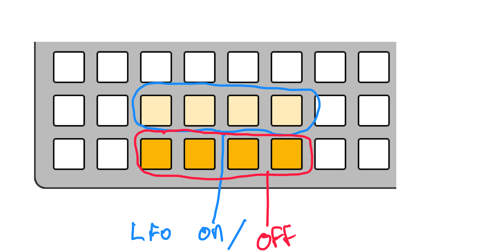

# otis v2

stereo "tape" delay/looper thing for norns

join the conversation at - https://llllllll.co/t/22149

---

there are three pages, _mix_, _play_, and _edit_. navigate with encoder 1. hold key 1 for ALT.

### _mix_

* key 2 = mute L
* key 3 = mute R

* enc 2 = vol L
* enc 3 = vol R
* ALT + enc 2 = pan L
* ALT + enc 3 = pan R

### _play_

* key 2 = flip L
* key 3 = flip R
* ALT + key 2 = skip L
* ALT + key 2 = skip R

* enc 2 = tape speed L
* enc 3 = tape speed R
* ALT + enc 2 = feedback L
* ALT + enc 3 = feedback R

_nb: tape speed behavior by default is free; however, it can be quantized to octaves via the **parameters** menu._
_skip behavior by default is a loop reset; however, it can be configured to jump to random positions via the **parameters** menu._

### _edit_

* key 2 = rec L on/off
* key 3 rec R on/off
* ALT + key 2 = clear buffer L
* ALT + key 3 = clear buffer R

* enc 2 = tape length L
* enc 3 = tape length R
* ALT + enc 2 = skip config
* ALT + enc 3 = speed config

_nb: turning rec L/R off will hold the buffer, allowing use as a looper._

---

# grid 

L/R loops are laid out identically:

touch a key inside the "loop posistion" area to jump to that point in the loop.

to "patch" an lfo:
* hold an **lfo on** button
* touch a control

while holding an **lfo on** button you can edit lfo parameters with the norns encoders and keys:
* enc 1: lfo speed/frequency
* enc 2: lfo depth
* enc 3: lfo offset

* key 2/3: set lfo shape

holding the grid alt button and pressing in the lfo section will "un-patch" the lfo.

holding the grid alt button and touching any speed button will return speed to 1.

holding the grid alt button and turning enc 2/3 will "slide" your L/R loops around the buffer.  

