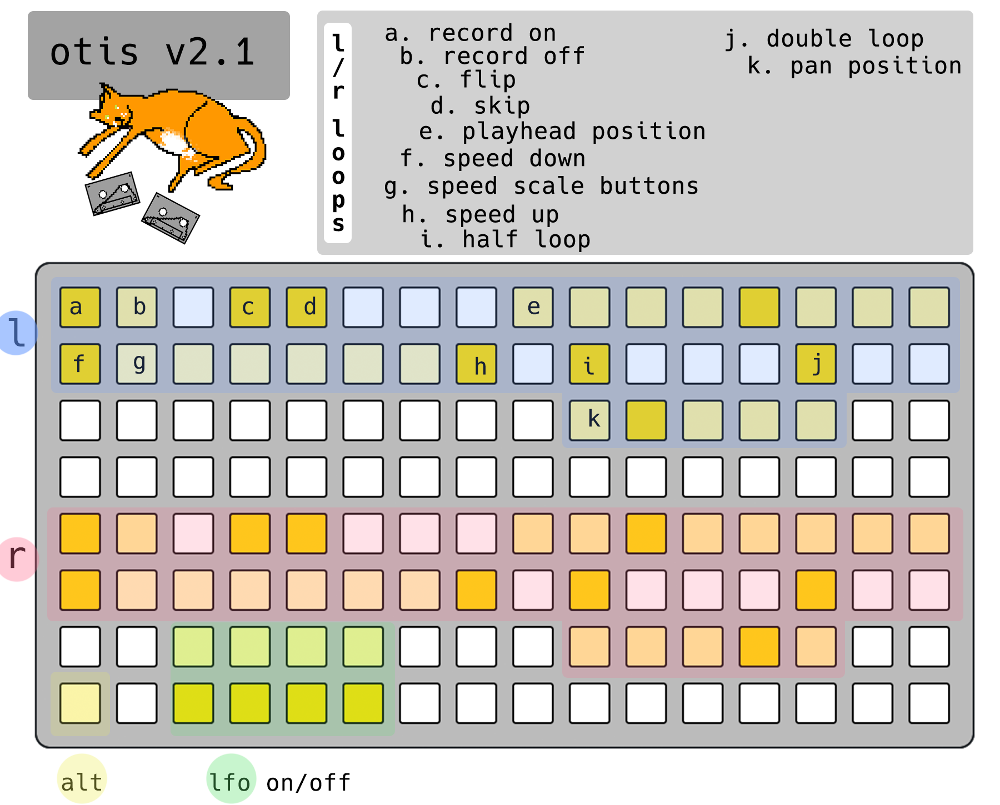
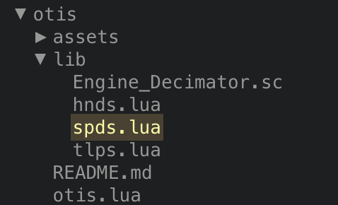
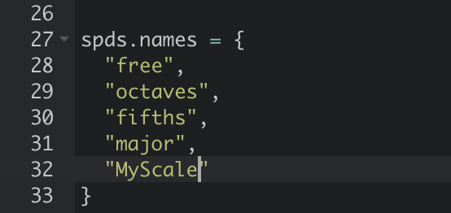
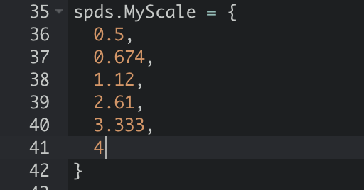

# otis v2.1

stereo "tape" delay/looper thing for norns

join the conversation at - https://llllllll.co/t/22149

---

there are three pages, _mix_, _play_, and _edit_. navigate with encoder 1. hold key 1 for ALT.

### _mix_

* key 2 = mute L
* key 3 = mute R

* enc 2 = vol L
* enc 3 = vol R
* ALT + enc 2 = pan L
* ALT + enc 3 = pan R

### _play_

* key 2 = flip L
* key 3 = flip R
* ALT + key 2 = skip L
* ALT + key 2 = skip R

* enc 2 = tape speed L
* enc 3 = tape speed R
* ALT + enc 2 = feedback L
* ALT + enc 3 = feedback R

_nb: tape speed behavior by default is free; however, it can be quantized to many different scales via the **parameters** menu._
_skip behavior by default is a loop reset; however, it can be configured to jump to random positions via the **parameters** menu._

### _edit_

* key 2 = rec L on/off
* key 3 rec R on/off
* ALT + key 2 = clear buffer L
* ALT + key 3 = clear buffer R

* enc 2 = tape length L
* enc 3 = tape length R
* ALT + enc 2 = skip config
* ALT + enc 3 = speed config

_nb: turning rec L/R off will hold the buffer, allowing use as a looper._

---

# grid 

* L/R loops are laid out identically.
* touch a key inside the "loop posistion" area to jump to that point in the loop.
* holding the **grid alt** button and touching one of the speed up/down buttons will return speed to 1.
* holding the **grid alt** button and turning enc 2/3 will "slide" your L/R loops around the buffer. 

---

# lfo's

while holding an **lfo on** button you can edit lfo parameters with the norns encoders and keys:
* enc 1: lfo speed/frequency
* enc 2: lfo depth
* enc 3: lfo offset
* key 2/3: set lfo shape

to "patch" an lfo:

* hold an **lfo on** button
* adjust lfo settings
* touch a control

holding the grid alt button and pressing in the lfo section will "un-patch" the lfo.

---

# speed scales

speed scales are collections of 6 speeds that are playable via the grid. adding your own "tunings" is easy.

* connect norns to wifi and launch maiden
* open the ``dust/code/otis/lib`` folder
* open the file named ``spds.lua``

to add your custom scale, simply:

* add the scale name to the ``spds.names`` table. (it's likely best to avoid spaces and special characters)

* add a ``spds.YourNameGoesHere`` table containing six numbers 0-4.

that's it! you're a musical hacker person now!
 
# parameter details

### l/r loops
* vol - loop volume
* speed - playback and recording speed
* speed slew - the time it takes for your speed to "settle" at its destination speed.
* loop start - start of your loop in seconds
* loop end - end of your loop in seconds
* feedback - how much of your overwritten material should stick around? 1 is all, 0 is none.
* rec - enable/disable recording
* pan - stereo posistion
* pan slew - time it takes for your pan position to "settle" at its destination position.

### engine
* sample rate
* bit depth
* saturation - tape style saturation amount
* crossover - crossover frequency for the effect filters
* tone
* noise - tape hiss amount

### modulation
* lfo target - select parameter to modulate
* lfo shape - sine, square, or sample and hold
* lfo depth - amount of modulation
* offset - lfo offset amount
* lfo freq - lfo speed
* lfo - lfo on/off toggle

### config
* skip controls - wether skip jumps back to the start of your loop, or to a random position
* speed scale - set your speed scale/quantizing
* audio routing - set the signal flow. default is input + softcut -> engine.